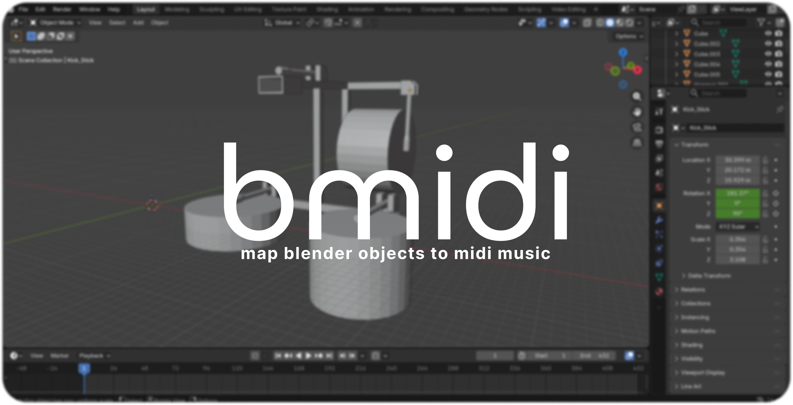

`bmidi` is a Python-based automatic keyframing tool for MIDI data, allowing users to create smooth MIDI-driven animations in Blender.

## Installing `bmidi`

`bmidi` is not currently available as a full Blender addon, so creating a clone of this repository is necessary for usage.

### 1. Clone The Repo

Clone this repository into the desired folder with:

```sh
git clone https://github.com/ktechhydle/bmidi.git
```

### 2. Install The Python Requirements

Find the Blender Python executable's path using `bpy.app.binary_path` in the console, then input the following into a new terminal (located in this repositories root):

```sh
'<your blender python path>' -m pip install -r requirements.txt
```

You may have to ensure `pip` actually exists by first using:

```sh
'<your blender python path>' -m ensurepip
```

Then upgrading it with:

```sh
'<your blender python path>' -m pip install --upgrade pip
```

### 3. Run `main.py`

Create a new Blender project inside the root of this repository, and open the `main.py` file inside the "Script" tab. Run the file with `Alt-P` or use the run button located right next to the file name, and you're done!

## Using `bmidi`

`bmidi`'s user interface is just a single panel with controls for frame generation.

- You can add or remove items with the "+" or "-" buttons located in the top right of the panel.
- Items can either be **compositions** or **controllers**, depending on what you select in "Type". 
- Compositions represent a collection of instrument(s) that map notes to object names. For example, an object named `Key_25` might be triggered whenever note 25 is played in the midi file. Given an object prefix `x` and note `y` the format for objects in compositions is `xy`
- Controllers represent a unique individual instrument like a robotic arm.

For all items, there is a `Channel` selector for selecting the specific channel that controls the objects. `Note Range Start` and `Note Range End` will allow notes between that range. Additionally, if `Use Block List` is selected, you can create a comma seperated list of notes to block from being generated (e.g. `24, 52, 60`) or a range of notes with the syntax `x-y`. 

**Clicking "Generate Keyframes" will set the timeline to `-1`, reset the animation data for all composition and controller objects, then generate the frames.**

## Capabilites

There are a collection of demo videos in [this YouTube playlist](https://www.youtube.com/playlist?list=PLRZuj2NaHK4KhIysZkML9mRQQlm8HeguG) showcasing what `bmidi` is capable of. Additionally, all music is original.
